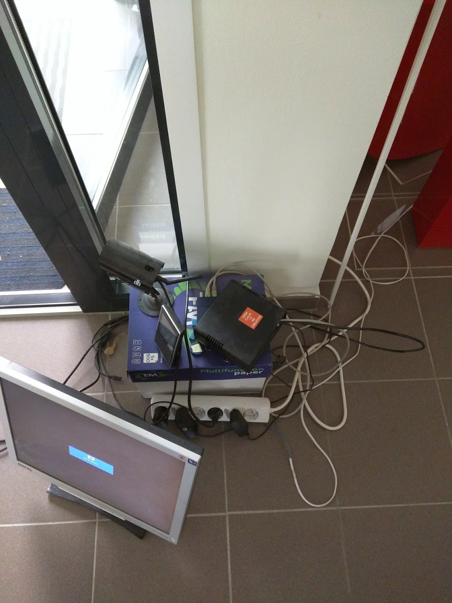
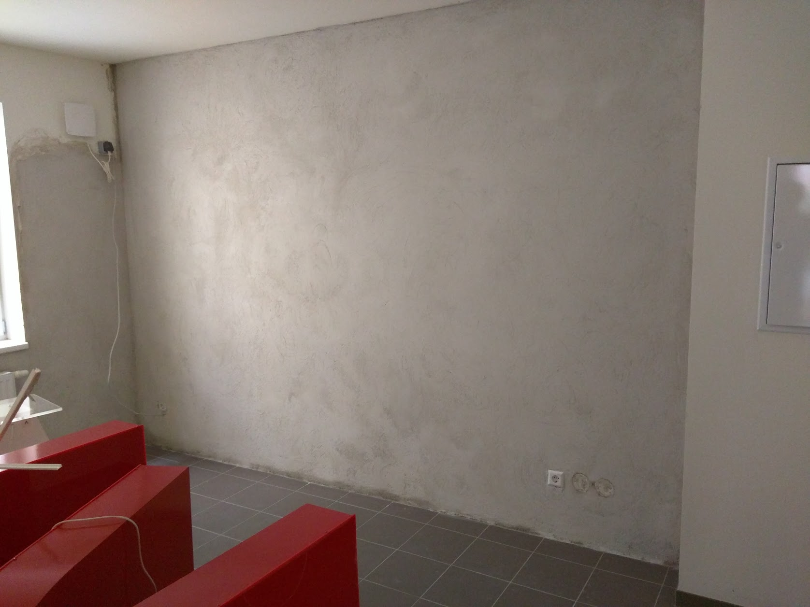
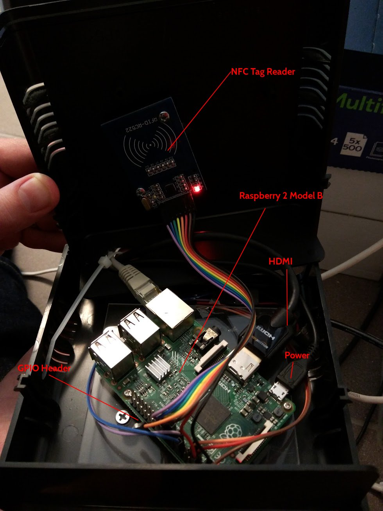
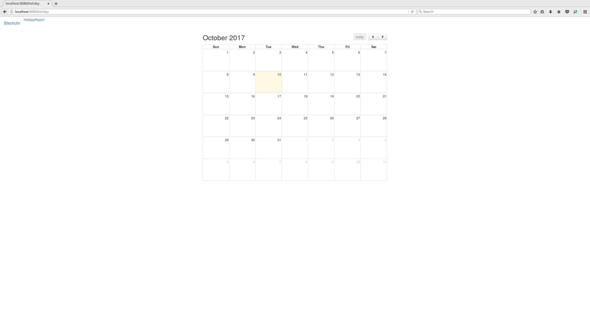
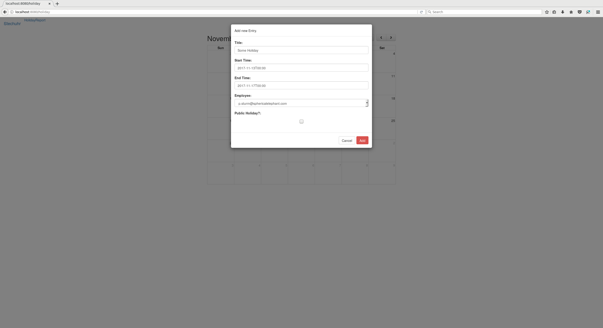
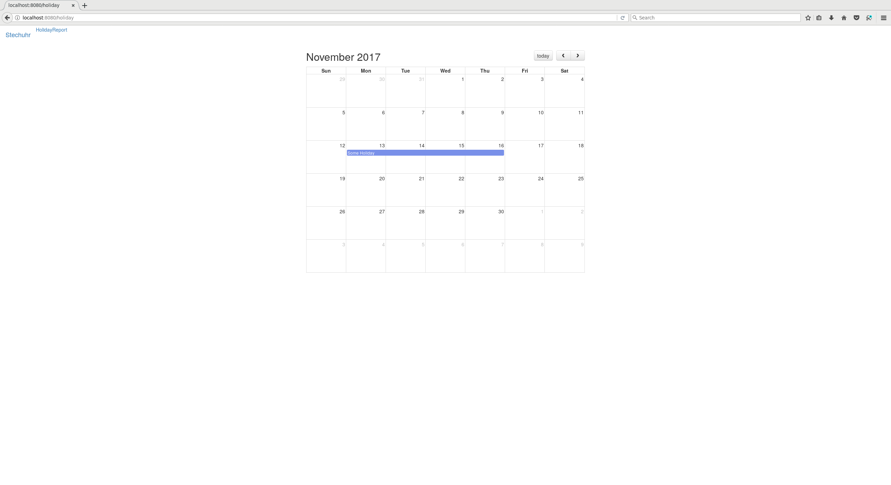
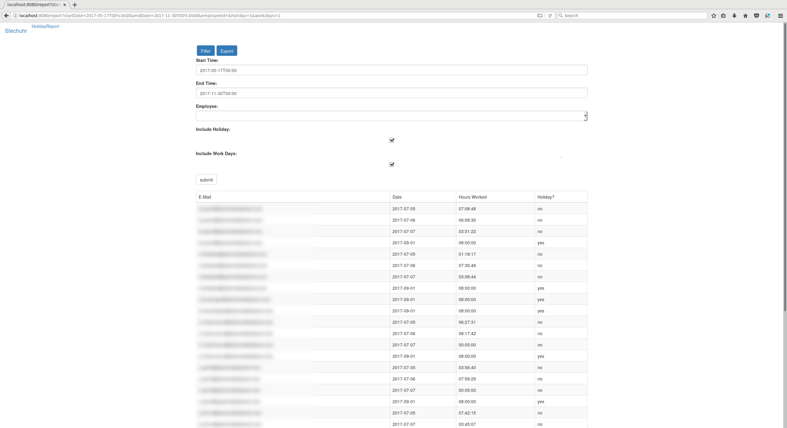

% Custom Built Stechuhr 
% Patrick Sturm
% 10.10.2017

# Agenda

## Agenda

* Intro
    * Motivation
    * MPV - Features
    * Challenges
* Hardware (pictures!)
* Technologies Used
* Some implementation details
* Outlook

# Intro

## Motivation

* Austrian law requires employers to keep track of employee attendance times.
* When our little company grew, keeping track using spreadsheets or later toggle became a tedious task.
* We needed a different solution: rather than buying a cheap proprietary solution, I decided to start a "small" weekend project, how much work could it be?!
    * I should mention that I am in no way a hardware specialist nor do I know my way around circuit boards. I also didn't invest a lot of time researching the technologies ;)!

## MVP - Features

* User accounts / identification
* Track tag in / tag out times
    * Automatically create tag out times if people forgot to tag out
    * Notify people about not logging out and providing a way to modify the automatically created time log
* Calculate daily times
* Generate simple reports (CSV)

## Challenges

* Finding supported hardware
    * Vendors on the internet claim that their hardware is supported on raspberry - they are full of shit...
* Finding libraries that support GPIO (General-purpose input / output) and mfrc522 (in this case NFC)
    * We had to deal with JavaScript wrappers for python implementations at first ...

## Annoyances

* The Raspberry Pi is not a processing monster
    * Compilation takes a painfully long time
    * Some modules that contain native code do not have prebuild binaries for ARM*
        * e.g. sqlite3

# Hardware

## Overview

* awk '/Revision/ {print $3}' /proc/cpuinfo | sed 's/^1000//'
    * Refer to: https://elinux.org/RPi_HardwareHistory
    * We are currently using the Pi 2 - Model B
* NFC Reader:
    * Neuftech Mifare RC522 IC Card RFID RFID Module Kits KeyCard / RF Reader IC Karte Modul DC 3.3V 13,56 MHz for Arduino
* Speaker:
    * Generic pcspkr

## Outside View



## Reason For Dusty Equipment



## Inside View



# Technologies

## Talking to the hardware

* mfrc522-rpi
    * allows reading / writing
    * native! - no python wrapper junk
* rpi-gpio
    * epoll based - linux only :D
    * native!

## Business Logic

* express
* pug
* sequelize / squel
* nodemailer
* bootstrap
* fullcaledar
* commander
* csv-parse / csv-stringify

## UI

* TCL / TK *cough*

# Implementation Details

## Audio Notification On Tag In / Tag Out

* Works via GPIO
* What happens:
    * set a naming schema
    * setup the channel, i.e. the pin that you want to address for reading and / or writing
    * write data to the channel (light on / light off)

## Audio Notification On Tag In / Tag Out - Code

```javascript
const gpio = require('rpi-gpio');
// the channel we want to write to, i.e. the pin
const channel = 22;
// turns channel on
const value = true;
// BCM pin schema, Broadcom SOC Channel naming schema
gpio.setMode(gpio.MODE_BCM);
gpio.setup(channel, gpio.DIR_OUT, (err) => {
    if (err) ...; // error handling
    // we can write here
    gpio.write(channel, value, (err) => {
        if (err) ...; // error handling
    });
});
```

## MFRC522

* MIFARE Reader / Writer (NFC in our case)
* Accesses via GPIO, mfrc522-rpi is an abstraction layer
* We are using the NFC chip ID as a User identifier, but NFC supports crypto mechanisms as well:
    * can prevent copying
    * made for authentication, etc

## MFRC522 - Code

```javascript
const mfrc522 = new (require('mfrc522-rpi'))();
const noop = () => { };

module.exports = {
  start: (opts) => {
    opts.interval = opts.interval || 50;
    opts.onError = opts.onError || noop;
    opts.onUid = opts.onUid || noop;
    opts.onStart = opts.onStart || noop;
    opts.onExit = opts.onExit || noop;
    setInterval(() => {
      const response = mfrc522.findCard();
      if (!response.status) return;
      response = mfrc522.getUid();
      if (!response.status)
        return opts.onError(new Error('UID scan error: ' + response.status));
      opts.onUid(response.data.slice(0, 
        response.data.length - 1).join(','));
    }, opts.interval);

    opts.onStart();
  }
};
```

## Console interface

  Usage: console <command>

  Commands:

    adduser <name> <email> <matrix> <code>
    deluser <name>
    listusers
    addtimelog <code>
    listtimelogs <name>
    listdefaulters
    informdefaulters
    closedefaulters
    readnfc

  Options:

    -h, --help     output usage information
    -V, --version  output the version number


# Outlook

## Outlook

* I am currently working on the following features:
    * Holiday support
    * Sophisticated filtering / report generation
    * Time Tracking (Customers / Projects / Ticket Integration) - we really want to get rid of toggl...
    * SPA via Mithril, getting rid of pug

## GUI


## Frontend - Calendar



## Frontend - Holiday Creation



## Frontend - Holiday Display



## Frontend - Timelog Display



# Questions?
